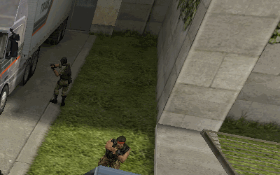

# 32 Spawns Initiative

This repository contains a collection of telefrag-free 32-spawns entity files for GoldSource based games (primarily, Counter-Strike 1.6) and means to install them.

## What is an entity?

> entities define all aspects of a map that make a map playable and interactive

Source: [TWHL](https://twhl.info/wiki/page/entity)

## What is an entity file?

Entity file is a Plain Text file that stores a list of entities.

`ripent` is a piece of software that, among other things, lets you export and import entity files.

## What is a spawn point?

A spawn point (Spawn) is a special entity that instructs the game engine on where to teleport the player in the start of the round.

|Spawn type|Entity name|
|:-:|:-|
|CT|info_player_start|
|T|info_player_deathmatch|
|VIP|info_vip_start|

## What is telefrag?

Telefrag is when you kill others or get killed yourself while landing a teleport.

For instance, when you get teleported to the spawn point in the start of the round.

The top reasons for telefrag are as follows:
- Spawns are placed too closed to each other.
- Spawns are placed too close to world object.

## 32SI.bat

Update entities in a single file or a collection of files.

    C:\> 32SI.bat mapname.bsp
    C:\> 32SI.bat folder

## Requirements

ripent.exe (x86) or ripent_x64.exe (x64) saved to the `tools` folder.
